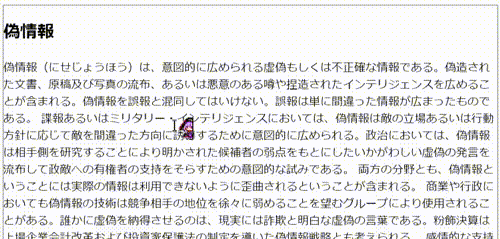

HTMLの改ざんを検知したらその旨を表示
====================================

試し方
------

開発ツールを開いて、適当に枠線内を書き換えようとしてみてください。"【改ざん済み】"と表示されます。

仕組み
------

MutationObserverを利用しています。変更されると、attributeを書き換え、改ざんされていることを表します。

注意
----

- このツールで防げるものは、入れ知恵された技術レベルの低い愉快犯によるコンテンツの改変です。本気で改変される場合、手も足も出ません。
- 実際に利用する場合、関数名、変数名などは難読化すると、より効果的かもしれません。
- 動的なサイトの場合、onLoadedで行っているオリジナルの保存を工夫する必要があるかと思います。
- 作者はJavaScript/HTML/CSSに熟達しているわけではありません。変なところはご容赦ください。

### 利用に関して

"釣り"のない世界づくりのために、制約なく、ぜひご利用ください。

#### 連絡先:   

作者: limemidolin

* Twitter: [limemidolin](https://twitter.com/limemidolin)
* Webサイト: [Flush memories](https://midolin.info/)
* GitHub: [limemidolin on GitHub](https://github.com/limemidolin)

